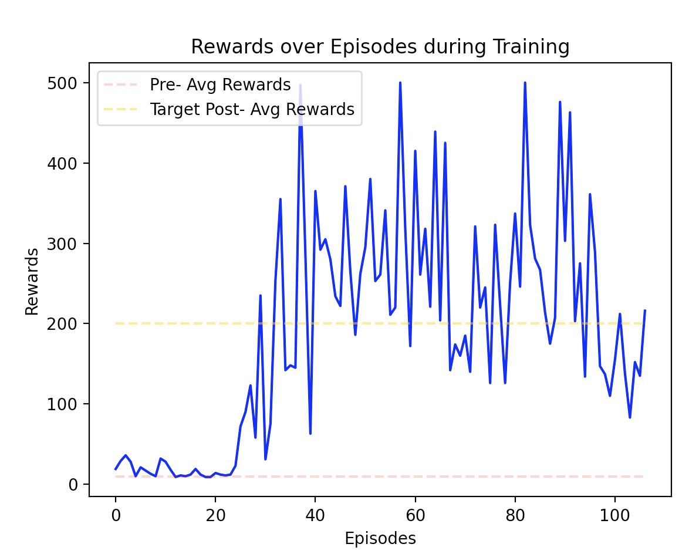
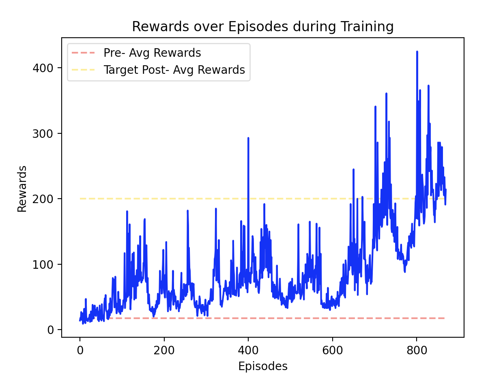

# Notes about Implemented Reinforcement Learning Algorithms

## Deep Q_Network

### Pseudocode Used for Implementation  

Initialize replay memory $D$ to capacity $N$  
Initialize action-value function $Q$ with random weights $\theta$  
Initialize target action-value function $\hat{Q}$ with weights $\theta^{-}=\theta$  
**For** episode= $1, M$ **do**  
&nbsp;&nbsp;&nbsp;&nbsp; Initialize sequence $s_1={x_1}$ and preprocessed sequence $\phi_1=\phi(s_1)$ 
&nbsp;&nbsp;&nbsp;&nbsp; **For** $t=1, T$ **do**  
&nbsp;&nbsp;&nbsp;&nbsp;&nbsp;&nbsp;&nbsp;&nbsp; With probability $\epsilon$ select a random action $a_t$  
&nbsp;&nbsp;&nbsp;&nbsp;&nbsp;&nbsp;&nbsp;&nbsp; otherwise select $a_t=argmax_a Q(\phi(s_t), a; \theta)$  
&nbsp;&nbsp;&nbsp;&nbsp;&nbsp;&nbsp;&nbsp;&nbsp; Execute action $a_t$ in emulator and observe reward $r_t$ and image $x_{t+1}$  
&nbsp;&nbsp;&nbsp;&nbsp;&nbsp;&nbsp;&nbsp;&nbsp; Set $s_{t+1}=s_t, a_t, x_{t+1}$ and preprocess $\phi_{t+1}=\phi (s_{t+1})$  
&nbsp;&nbsp;&nbsp;&nbsp;&nbsp;&nbsp;&nbsp;&nbsp; Store transition $(\phi_t, a_t, r_t, \phi_{t+1})$ in $D$  
&nbsp;&nbsp;&nbsp;&nbsp;&nbsp;&nbsp;&nbsp;&nbsp; Sample random minibatch of transitions $(\phi_j, a_j, r_j, \phi_{j+1})$ from $D$  
&nbsp;&nbsp;&nbsp;&nbsp;&nbsp;&nbsp;&nbsp;&nbsp; Set $y_j=r_j$ if episode terminates at step $j+1$ else set $y_j=r_j+\gamma max_{a'} \hat{Q}(\phi_{j+1}, a'; \theta^-)$  
&nbsp;&nbsp;&nbsp;&nbsp;&nbsp;&nbsp;&nbsp;&nbsp; Perform a gradient descent step on $(y_j-Q(\phi_j, a_j; \theta))^2$ with respect to the network parameters $\theta$  
&nbsp;&nbsp;&nbsp;&nbsp;&nbsp;&nbsp;&nbsp;&nbsp; Every $C$ steps reset $\hat{Q}=Q$  
&nbsp;&nbsp;&nbsp;&nbsp; **End For**  
**End For**  
 
### Results  
We first initialized a neural net to use for the deep q-network algorithm and ran it to see the average rewards per episode of this initialized, non-learned net. Next we started the training of the neural net for the deep q-network to update the weights to minimize the loss function from the pseudocode above. While doing so, we updated the target network to match the same weight parameters as the network we use to train every so often, in regular intervals. We stopped the training once it hit an average reward per episode of 200 for the last 100 episodes. The graph below shows the rewards collected per episode during the training process along with the average reward per episode before training and after training.  
  
 
### Additional Notes  
Although in the graph shown above, there seems to be a very quick learning process towards the intended target average rewards, this is not always the case. Running with the same hyperparameters gives a decently fast convergence towards the intended target average rewards (< 200 episodes), but other times, the network seems to get stuck in a local minimum and unable to get out within the set episode limit.  
 
 
## REINFORCE Monte-Carlo Policy Gradient  

### Pseudocode Used for Implementation  

Initialize $\theta$ at random  
Generate one episode $S_1, A_1, R_2, S_2, A_2, \cdots, S_T$  
**For** t= $1, T$ **do**  
&nbsp;&nbsp;&nbsp;&nbsp; Estimate the return $G_t$ since the time step $t$  
&nbsp;&nbsp;&nbsp;&nbsp; $\theta \leftarrow \theta + \alpha \gamma^t G_t \nabla ln \pi(A_t|S_t, \theta)$  
**End For**  
 
### Results  
We first initialized a neural net to use for the REINFORCE algorithm and ran it to see the average rewards per episode of this initialized, non-learned net. Next we started the training of the neural net for the REINFORCE algorithm and updated the weights by the equation in the pseudocode above. We stopped the training once it hit an average reward per episode of 200 for the last 100 episodes. The graph below shows the rewards collected per episode during the training process along with the average reward per episode before training and after training.  
  
 
### Additional Notes  
There seems to be a much higher variance in the rewards collected after each episode for REINFORCE compared to DQN. It also seems to take much longer for the parameters in the neural net to learn the best policy.  
 
 

